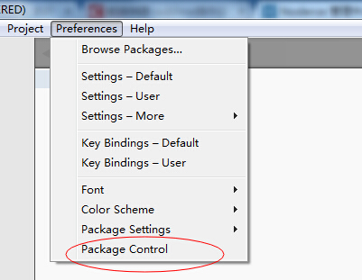

sublime text3的具体相关的教程
------------------------------
### sublime 的安装
### subiime 的插件安装
>[详细教程来源](http://www.cnblogs.com/liuchaoH/p/6370008.html)
>
>打开sublime 后打开控制台操作选项

>
>然后在控制台上输出install 在默认的情况下确定package
>
>接下来就可以找适合的插件来安装

### sublime的插件介绍
## 1.ChineseLocalizations
> sublime汉语化插件
>
## 2. Emmet
> 一个快速编写html/css的插件
>
## 3. HTML5 HTMLattributes
> 这两个插件对弥补了sublime对html5支持度不足的缺陷
>
## 4.sublimeCodeIntel
> 代码自动补全
>
## 5.sublimeCodeIntel
> 代码自动补全
>
[更多插件](http://blog.csdn.net/tsingsn/article/details/52186670)
### 更多插件以后慢慢补充

